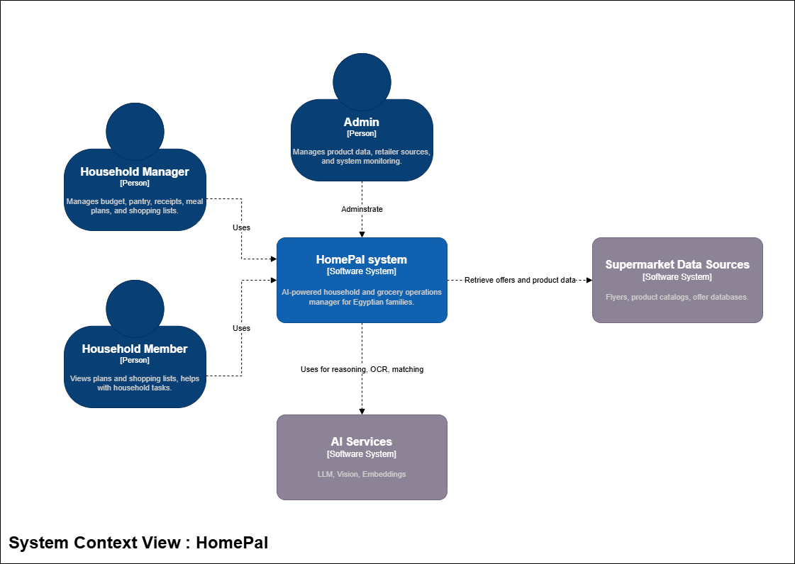
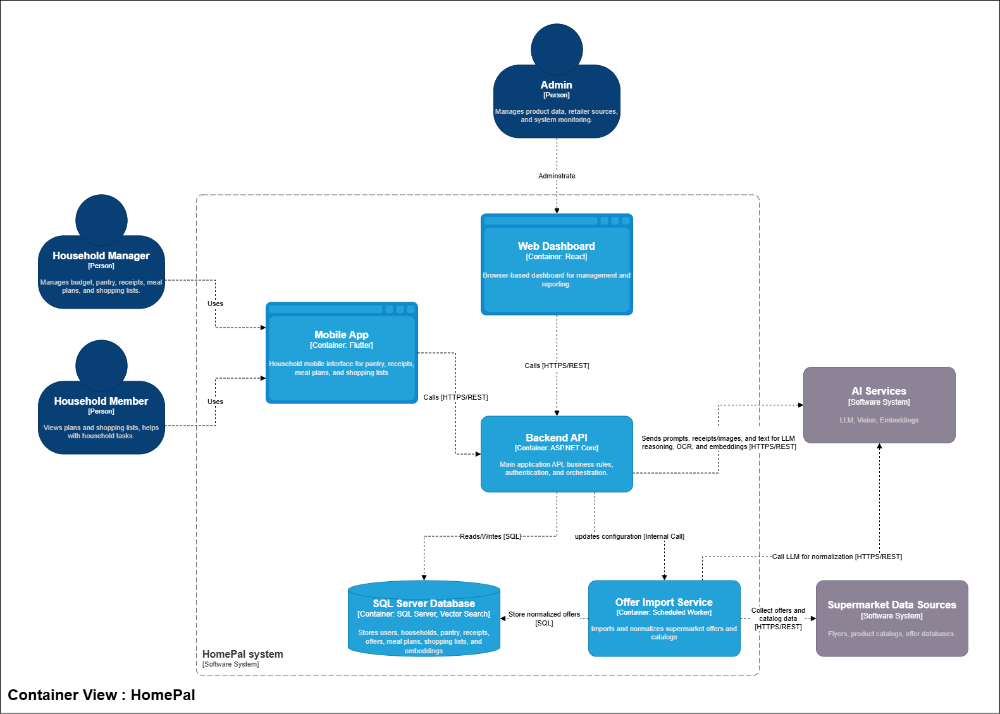
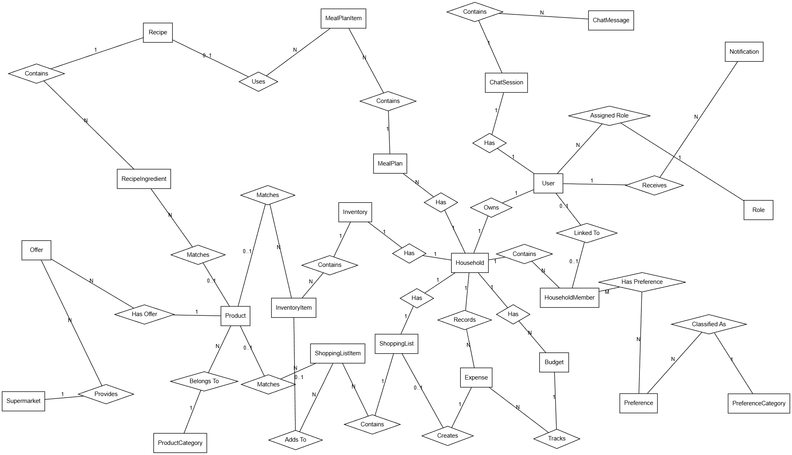
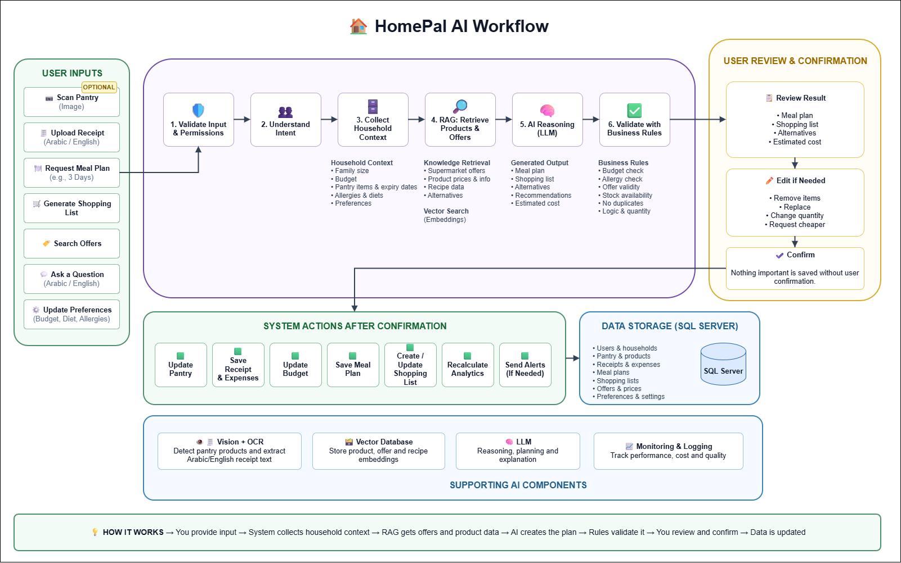

# HomePal — Project Design & Setup

## 1. Project Overview

**Project Name:** HomePal — Smart Household & Grocery Operations Manager

HomePal is an AI-powered household assistant that helps Egyptian families manage grocery budgets, track pantry inventory, process receipts, compare supermarket offers, generate affordable meal plans, and create optimized shopping lists.

### Primary Users

- **Household Manager:** Manages the budget, pantry, receipts, meal plans, and shopping lists.
- **Household Member:** Views plans and lists
- **Administrator:** Manages retailer data sources, product data, and system monitoring.

---

# 2. System Design

## 2.1 Architecture Diagram

### 2.1.1 System Context View


### 2.1.2 Container View




## 2.2 System Context Summary

### People

- **Household Manager:** Manages the budget, pantry, receipts, meal plans, shopping lists, and confirms AI suggestions.
- **Household Member:** Views plans and shopping lists.
- **Administrator:** Manages products, retailer data sources, import failures, and system monitoring.

### External Systems

- **Supermarket Data Sources:** Product catalogs, weekly flyers, offer databases, and manually uploaded flyers.
- **AI Services:** LLM, vision, and embedding generation.

## 2.3 Main Containers

### Mobile Application

- **Technology:** Flutter
- Supports pantry scanning, receipt uploads, meal plans, offers, and shopping lists.
- Communicates with the Backend API through HTTPS/REST using JSON.

### Web Dashboard

- **Technology:** React
- Supports household management, reports, offer comparison, and administration.
- Communicates with the Backend API through HTTPS/REST using JSON.

### Backend API

- **Technology:** ASP.NET Core
- Handles authentication, authorization, validation, and business rules.
- Manages pantry, budgets, receipts, offers, meal plans, and shopping lists.
- Coordinates AI operations and reads/writes data in SQL Server.


### Offer Import Service

- **Technology:** .NET Scheduled Worker
- Imports and normalizes supermarket products and offers.
- Uses approved automatic sources and manual flyer processing as a fallback.

### SQL Server Database

- **Technology:** SQL Server 2025
- Stores relational application data and vector embeddings.
- Supports semantic search, product matching, and offer retrieval.

---

# 3. Database Design

## 3.1 ERD Diagram



# 3.2 Entities and Main Attributes

## User

`UserId, FullName, Username, Email, Password, PhoneNumber`

## Role

`RoleId, Name, Description`

## Household

`HouseholdId, Name, Country, City, CreatedAt`

## HouseholdMember

`HouseholdMemberId, FullName, MemberRole, AgeGroup, IsRegisteredUser`

## PreferenceCategory

`PreferenceCategoryId, Name, Description`

## Preference

`PreferenceId, Name, NameArabic, Description, IsActive`

## Inventory

`InventoryId, Name, Description, LowStockThreshold, LastScannedAt`

## InventoryItem

`InventoryItemId, RawName, Quantity, Unit, ExpiryDate, StorageLocation, EstimatedPrice, Source, MatchStatus`

## Product

`ProductId, Name, Brand, Barcode, Size, Unit`

## ProductCategory

`ProductCategoryId, Name, Description`

## Supermarket

`SupermarketId, Name, Country, City`

## Offer

`OfferId, OriginalPrice, CurrentPrice, Discount, StartDate, EndDate, IsActive`

## ShoppingList

`ShoppingListId, Status, EstimatedTotal, ActualTotal, ConfirmedAt, CompletedAt`

## ShoppingListItem

`ShoppingListItemId, RawName, Quantity, Unit, EstimatedPrice, ActualPrice, Priority, IsPurchased`

## Recipe

`RecipeId, Name, Description, Instructions, PreparationTime, CookingTime, Servings, EstimatedCost, Category`

## RecipeIngredient

`RecipeIngredientId, IngredientName, Quantity, Unit, IsOptional`

## MealPlan

`MealPlanId, StartDate, NumberOfDays, EstimatedCost, MaximumBudget, Status`

## MealPlanItem

`MealPlanItemId, MealName, DayNumber, MealType, Servings, EstimatedCost, IsConfirmed`

## Budget

`BudgetId, Month, Year, LimitAmount, WarningPercentage`

## Expense

`ExpenseId, Category, Amount, Description, ExpenseDate, Source`

## Notification

`NotificationId, Type, Title, Message, IsRead, CreatedAt`

## ChatSession

`ChatSessionId, Title, CreatedAt, UpdatedAt`

## ChatMessage

`ChatMessageId, SenderType, MessageText, CreatedAt`


---
# 4. API Design

## 4.1 API Conventions

- Base URL: `/api`
- Format: JSON
- Authentication: JWT Bearer Token
- Documentation: OpenAPI / Swagger
- Dates: ISO 8601
- Currency: Egyptian Pound (EGP)
- Pagination parameters: `page` and `pageSize`

### Standard Success Response

```json
{
  "success": true,
  "data": {},
  "message": "Operation completed successfully."
}
```

### Standard Error Response

```json
{
  "success": false,
  "message": "Validation failed.",
  "errors": {
    "field": ["Error description"]
  }
}
```

# 4.2 API Endpoints

## 4.2.1 Authentication and Profile

Authentication and profile operations are grouped under the account umbrella.

|Method|Endpoint|Description|
|---|---|---|
|`POST`|`/auth/register`|Register a new user account.|
|`POST`|`/auth/login`|Authenticate the user and return tokens.|
|`POST`|`/auth/forgot-password`|Send a password-reset code or link.|
|`POST`|`/auth/reset-password`|Reset the user’s password.|
|`POST`|`/auth/refresh-token`|Generate a new access token.|
|`POST`|`/auth/logout`|Revoke the current session.|
|`GET`|`/users/me`|Get the logged-in user’s profile.|
|`PATCH`|`/users/me`|Update the logged-in user’s profile.|
|`DELETE`|`/users/me`|Deactivate the logged-in user’s account.|

---

## 4.2.2 Household and Members

The household is resolved internally from the authenticated user.

|Method|Endpoint|Description|
|---|---|---|
|`POST`|`/household`|Create the user’s household.|
|`GET`|`/household`|Get the user’s household.|
|`PATCH`|`/household`|Update household information.|
|`DELETE`|`/household`|Delete or deactivate the household.|
|`GET`|`/household/members`|Get all household members.|
|`GET`|`/household/members/{memberId}`|Get a specific household member.|
|`POST`|`/household/members`|Add a household member.|
|`PATCH`|`/household/members/{memberId}`|Update a household member.|
|`DELETE`|`/household/members/{memberId}`|Remove a household member.|

---

## 4.2.3 Household Member Preferences

Preference catalog management and member preference assignment are grouped under preferences.

|Method|Endpoint|Description|
|---|---|---|
|`GET`|`/preferences/categories`|Get all preference categories.|
|`GET`|`/preferences/categories/{categoryId}`|Get a specific preference category.|
|`POST`|`/preferences/categories`|Create a preference category. Admin only.|
|`PATCH`|`/preferences/categories/{categoryId}`|Update a preference category. Admin only.|
|`DELETE`|`/preferences/categories/{categoryId}`|Deactivate a preference category. Admin only.|
|`GET`|`/preferences`|Get all available preferences.|
|`GET`|`/preferences/{preferenceId}`|Get a specific preference.|
|`POST`|`/preferences`|Create a preference. Admin only.|
|`PATCH`|`/preferences/{preferenceId}`|Update a preference. Admin only.|
|`DELETE`|`/preferences/{preferenceId}`|Deactivate a preference. Admin only.|
|`GET`|`/household/members/{memberId}/preferences`|Get a member’s selected preferences.|
|`PUT`|`/household/members/{memberId}/preferences`|Replace all preferences of a member.|
|`POST`|`/household/members/{memberId}/preferences`|Add preferences to a member.|
|`DELETE`|`/household/members/{memberId}/preferences/{preferenceId}`|Remove a preference from a member.|

---

## 4.2.4 Products, Categories, Supermarkets, and Offers

All marketplace-related resources are grouped under the catalog umbrella.

### Product Categories

|Method|Endpoint|Description|
|---|---|---|
|`GET`|`/catalog/categories`|Get product categories.|
|`GET`|`/catalog/categories/{categoryId}`|Get a specific category.|
|`POST`|`/catalog/categories`|Create a category. Admin only.|
|`PATCH`|`/catalog/categories/{categoryId}`|Update a category. Admin only.|
|`DELETE`|`/catalog/categories/{categoryId}`|Deactivate a category. Admin only.|

### Products

|Method|Endpoint|Description|
|---|---|---|
|`GET`|`/catalog/products`|Get products with filters and pagination.|
|`GET`|`/catalog/products/{productId}`|Get a specific product.|
|`POST`|`/catalog/products`|Create a product. Admin only.|
|`PATCH`|`/catalog/products/{productId}`|Update a product. Admin only.|
|`DELETE`|`/catalog/products/{productId}`|Deactivate a product. Admin only.|

### Supermarkets

|Method|Endpoint|Description|
|---|---|---|
|`GET`|`/catalog/supermarkets`|Get supermarkets.|
|`GET`|`/catalog/supermarkets/{supermarketId}`|Get a specific supermarket.|
|`POST`|`/catalog/supermarkets`|Create a supermarket. Admin only.|
|`PATCH`|`/catalog/supermarkets/{supermarketId}`|Update a supermarket. Admin only.|
|`DELETE`|`/catalog/supermarkets/{supermarketId}`|Deactivate a supermarket. Admin only.|

### Offers

|Method|Endpoint|Description|
|---|---|---|
|`GET`|`/catalog/offers`|Get active offers with filters and pagination.|
|`GET`|`/catalog/offers/{offerId}`|Get a specific offer.|
|`POST`|`/catalog/offers`|Create an offer. Admin only.|
|`PATCH`|`/catalog/offers/{offerId}`|Update an offer. Admin only.|
|`DELETE`|`/catalog/offers/{offerId}`|Deactivate an offer. Admin only.|
|`GET`|`/catalog/products/{productId}/offers`|Get offers for a specific product.|
|`GET`|`/catalog/supermarkets/{supermarketId}/offers`|Get offers from a supermarket.|

Example:

```text
GET /catalog/offers?productId=10&supermarketId=4&isActive=true
```

---

## 4.2.5 Inventory

Each household has exactly one inventory, so `inventoryId` is not needed in the route.

|Method|Endpoint|Description|
|---|---|---|
|`GET`|`/inventory`|Get the household’s inventory and settings.|
|`PATCH`|`/inventory`|Update inventory information and settings.|
|`GET`|`/inventory/items`|Get all inventory items.|
|`GET`|`/inventory/items/{itemId}`|Get a specific inventory item.|
|`POST`|`/inventory/items`|Add an inventory item manually.|
|`PATCH`|`/inventory/items/{itemId}`|Update an inventory item.|
|`DELETE`|`/inventory/items/{itemId}`|Remove an inventory item.|
|`POST`|`/inventory/scan`|Scan pantry images and return detected items.|
|`POST`|`/inventory/scan/confirm`|Confirm detected items and update inventory.|

The scan operation does not modify the inventory until the confirmation request is made.

---

## 4.2.6 Shopping List

Each household has exactly one shopping list, so `shoppingListId` is not needed in the route.

|Method|Endpoint|Description|
|---|---|---|
|`GET`|`/shopping-list`|Get the household’s shopping list.|
|`PATCH`|`/shopping-list`|Update shopping-list information.|
|`POST`|`/shopping-list/confirm`|Confirm the shopping list.|
|`POST`|`/shopping-list/complete`|Complete the shopping list.|
|`DELETE`|`/shopping-list/items`|Clear all shopping-list items.|
|`GET`|`/shopping-list/items`|Get all shopping-list items.|
|`GET`|`/shopping-list/items/{itemId}`|Get a specific shopping-list item.|
|`POST`|`/shopping-list/items`|Add a product or manually entered item.|
|`PATCH`|`/shopping-list/items/{itemId}`|Update a shopping-list item.|
|`DELETE`|`/shopping-list/items/{itemId}`|Remove a shopping-list item.|

Completing the shopping list may:

- Mark selected items as purchased.
    
- Add purchased items to the inventory.
    
- Calculate the actual total.
    
- Create an expense.
    

---

## 4.2.7 Recipes

Recipe and recipe ingredient operations are grouped under the recipes umbrella.

|Method|Endpoint|Description|
|---|---|---|
|`GET`|`/recipes`|Get recipes with filters and pagination.|
|`GET`|`/recipes/{recipeId}`|Get a recipe with its ingredients.|
|`POST`|`/recipes`|Create a recipe. Admin only.|
|`PATCH`|`/recipes/{recipeId}`|Update a recipe. Admin only.|
|`DELETE`|`/recipes/{recipeId}`|Deactivate a recipe. Admin only.|
|`GET`|`/recipes/{recipeId}/ingredients`|Get recipe ingredients.|
|`POST`|`/recipes/{recipeId}/ingredients`|Add an ingredient. Admin only.|
|`PATCH`|`/recipes/{recipeId}/ingredients/{ingredientId}`|Update an ingredient. Admin only.|
|`DELETE`|`/recipes/{recipeId}/ingredients/{ingredientId}`|Remove an ingredient. Admin only.|

---

## 4.2.8 Meal Plans

Meal-plan and meal-plan-item operations are grouped under the meal-plans umbrella.

|Method|Endpoint|Description|
|---|---|---|
|`POST`|`/meal-plans/generate`|Generate a meal plan from inventory, preferences, and budget.|
|`GET`|`/meal-plans`|Get previous meal plans.|
|`GET`|`/meal-plans/{mealPlanId}`|Get a meal plan with its items.|
|`PATCH`|`/meal-plans/{mealPlanId}`|Update a meal plan.|
|`DELETE`|`/meal-plans/{mealPlanId}`|Delete a meal plan.|
|`POST`|`/meal-plans/{mealPlanId}/confirm`|Confirm a meal plan.|
|`POST`|`/meal-plans/{mealPlanId}/add-missing-items`|Add missing ingredients to the household shopping list.|
|`GET`|`/meal-plans/{mealPlanId}/items`|Get planned meals.|
|`POST`|`/meal-plans/{mealPlanId}/items`|Add a meal-plan item.|
|`PATCH`|`/meal-plans/{mealPlanId}/items/{itemId}`|Update a meal-plan item.|
|`DELETE`|`/meal-plans/{mealPlanId}/items/{itemId}`|Remove a meal-plan item.|
|`POST`|`/meal-plans/{mealPlanId}/items/{itemId}/confirm`|Confirm a planned meal.|

The `add-missing-items` operation copies missing ingredients to the single household shopping list without creating a permanent ERD relationship.

---

## 4.2.9 Finance

Budget, expense, and report operations are grouped under the finance umbrella.

### Budgets

|Method|Endpoint|Description|
|---|---|---|
|`GET`|`/finance/budgets`|Get budget history.|
|`GET`|`/finance/budgets/current`|Get the current budget and spending summary.|
|`GET`|`/finance/budgets/{budgetId}`|Get a specific budget.|
|`POST`|`/finance/budgets`|Create a monthly budget.|
|`PATCH`|`/finance/budgets/{budgetId}`|Update a budget.|
|`DELETE`|`/finance/budgets/{budgetId}`|Delete a budget.|

### Expenses

|Method|Endpoint|Description|
|---|---|---|
|`GET`|`/finance/expenses`|Get household expenses.|
|`GET`|`/finance/expenses/{expenseId}`|Get a specific expense.|
|`POST`|`/finance/expenses`|Add an expense manually.|
|`PATCH`|`/finance/expenses/{expenseId}`|Update an expense.|
|`DELETE`|`/finance/expenses/{expenseId}`|Remove an expense.|

### Reports

|Method|Endpoint|Description|
|---|---|---|
|`GET`|`/finance/reports/summary`|Get a household financial summary.|
|`GET`|`/finance/reports/spending`|Get a spending report.|
|`GET`|`/finance/reports/inventory`|Get inventory usage and waste statistics.|
|`GET`|`/finance/reports/savings`|Get estimated savings statistics.|
|`POST`|`/finance/reports/export`|Generate and export a report.|

---

## 4.2.10 Notifications

|Method|Endpoint|Description|
|---|---|---|
|`GET`|`/notifications`|Get the logged-in user’s notifications.|
|`GET`|`/notifications/unread-count`|Get the unread notification count.|
|`PATCH`|`/notifications/{notificationId}/read`|Mark a notification as read.|
|`PATCH`|`/notifications/read-all`|Mark all notifications as read.|
|`DELETE`|`/notifications/{notificationId}`|Delete a notification.|

---

## 4.2.11 Chat

Each user has exactly one chat session, so `chatSessionId` is not required in the route.

|Method|Endpoint|Description|
|---|---|---|
|`GET`|`/chat`|Get the logged-in user’s chat session information.|
|`GET`|`/chat/messages`|Get messages from the user’s chat session.|
|`POST`|`/chat/messages`|Send a message to the assistant.|
|`DELETE`|`/chat/messages`|Clear the user’s chat history.|

---

# 5. AI Design

## 5.1 Large Language Model

**Selected approach:** Gemini Flash multimodal model.

Responsibilities:

- Understand Arabic and English requests.
- Generate budget-aware meal plans.
- Suggest cheaper alternatives.
- Explain recommendations.
- Normalize OCR output when needed.
- Replan when constraints change.

## 5.2 Agent Framework

**Selected tools:** LangFlow with Langfuse observability.

The agent will:

- Understand the requested operation.
- Retrieve household context.
- Retrieve offers and product information.
- Call OCR, vision, embeddings, and LLM services.
- Validate output against business rules.
- Replan invalid recommendations.
- Request user confirmation before critical changes.

## 5.3 Vector Database

**Selected technology:** SQL Server Vector Search.

Embeddings will be stored for:

- Products.
- Supermarket offers.
- Recipes and ingredients.
- Flyer-extracted product records.

Main uses:

- Product matching.
- Offer retrieval.
- Similar-product discovery.
- Cheaper alternative retrieval.

## 5.4 Embedding Model

Use a multilingual embedding model supporting Arabic and English.

The exact model will be selected during implementation based on:

- Arabic accuracy.
- Cost.
- Latency.
- Provider availability.

## 5.5 AI Workflow



## 5.6 AI Safety and Reliability

- AI output is treated as a suggestion until confirmed.
- Pantry and receipt updates require user confirmation.
- Budget calculations are performed by backend code.
- Offer dates are validated before recommendation.
- Receipt images are deleted after extraction unless retention is requested.

---
# 6. Project Setup

## 6.1 Repository Structure

A dedicated repository is configured for each stack (Backend - Web - Mobile)
## 6.2 Git Workflow

### Branches

- `main`: Stable and releasable code.
- `develop`: Integration branch.
- `feature/<feature-name>`
- `fix/<issue-name>`
- `docs/<document-name>`
- `chore/<task-name>`

### Pull Request Rules

- No direct pushes to `main`.
- Each feature uses a separate branch.
- Pull requests target `develop`.
- At least one reviewer is required.
- Tests must pass before merge.

## 6.3 Commit Convention

```text
feat: add pantry item endpoint
fix: correct receipt total validation
docs: add AI workflow
test: add budget service unit tests
refactor: simplify offer matching service
chore: configure CI pipeline
```

## 6.4 Coding Standards

- Use descriptive names.
- Keep functions focused.
- Avoid duplicated logic.
- Validate external input.
- Never commit secrets.
- Write tests for important business rules.
- Use asynchronous APIs for I/O.


---

# 7. Initial Product Backlog

## 7.1 Priority levels:

- **P0:** Must have
    
- **P1:** Important
    
- **P2:** Nice to have
    

## 7.2 User Stories And Task

| ID    | User Story                                                                                     | Tasks                                                                                                                                                                                                            | Priority |
| ----- | ---------------------------------------------------------------------------------------------- | ---------------------------------------------------------------------------------------------------------------------------------------------------------------------------------------------------------------- | -------- |
| US-01 | As a user, I want to register, log in, recover my password, and manage my profile.             | Backend: authentication and profile APIs. Mobile: auth and profile screens. Web dashboard: admin login only.                                                                                                     | P0       |
| US-02 | As a user, I want to create and manage my household.                                           | Backend: household creation and update. Mobile: household setup and settings. System: automatically create the household inventory and shopping list.                                                            | P0       |
| US-03 | As a user, I want to add, edit, and remove household members.                                  | Backend: member CRUD and validation. Mobile: member-management screens.                                                                                                                                          | P0       |
| US-04 | As a user, I want to invite a registered user to my household.                                 | Backend: send, accept, reject, cancel, and resend invitations. Mobile: invitation screens. Web dashboard: invitation activity monitoring.                                                                        | P1       |
| US-05 | As a user, I want to manage household and member preferences.                                  | Backend: preference categories, preferences, and household preference APIs. Mobile: preference selection. Web dashboard: manage available preference values. AI: use preferences as constraints.                 | P0       |
| US-06 | As a user, I want to view and manually manage my inventory.                                    | Backend: inventory item CRUD. Mobile: inventory list, add, edit, and delete. AI: optional product matching.                                                                                                      | P0       |
| US-07 | As a user, I want to scan a receipt and confirm the extracted data.                            | Backend: scan and confirmation APIs, inventory and expense update. Mobile: camera, review, correction, and confirmation. AI: OCR, item extraction, prices, totals, and matching. Web dashboard: scan monitoring. | P0       |
| US-08 | As a user, I want to scan my pantry and confirm detected items.                                | Backend: pantry scan and confirmation APIs. Mobile: camera and review flow. AI: item detection, quantity estimation, and product matching. Web dashboard: failed-scan monitoring.                                | P0       |
| US-09 | As a user, I want to browse and search products and offers.                                    | Backend: search, filters, pagination, and product details. Mobile: catalogue and offer screens. Web dashboard: product and offer management.                                                                     | P0       |
| US-10 | As a user, I want personalized product and offer recommendations.                              | Backend: recommendation endpoints. Mobile: recommendation sections. AI: ranking using preferences, budget, inventory, and shopping list. Web dashboard: recommendation analytics.                                | P1       |
| US-11 | As a user, I want to manage the shared shopping list.                                          | Backend: retrieve, add, edit, remove, and clear items. Mobile: shopping-list screen. AI: suggest low-stock and missing items.                                                                                    | P0       |
| US-12 | As a user, I want to confirm and complete my shopping list.                                    | Backend: calculate totals, confirm, complete, and apply related inventory or expense changes. Mobile: confirmation and completion flow. AI: suggest cheaper products and offers.                                 | P0       |
| US-13 | As a user, I want to browse recipes and view their details.                                    | Backend: recipe listing, details, search, and filters. Mobile: recipe screens. Web dashboard: recipe management. AI: optional semantic search and tagging.                                                       | P0       |
| US-14 | As a user, I want HomePal to generate a meal plan using my inventory, preferences, and budget. | Backend: generation, saving, editing, and confirmation. Mobile: generation and review screens. AI: generate constrained meal plans. Web dashboard: meal-generation analytics.                                    | P0       |
| US-15 | As a user, I want missing meal-plan ingredients added to my shopping list.                     | Backend: compare ingredients with inventory and update the list. Mobile: review missing items. AI: ingredient matching and quantity calculation.                                                                 | P0       |
| US-16 | As a user, I want to set and track my budget and expenses.                                     | Backend: current budget, history, and expense CRUD. Mobile: budget and expense screens. Web dashboard: aggregated spending analytics. AI: optional spending insights.                                            | P0       |
| US-17 | As a user, I want reports about spending, inventory, waste, and savings.                       | Backend: report aggregation and generation. Mobile: simple report summaries. Web dashboard: detailed reports, charts, filters, and exports. AI: generate report insights.                                        | P1       |
| US-18 | As a user, I want to ask the HomePal assistant questions using my household data.              | Backend: chat APIs and tool integration. Mobile: chat interface. AI: access inventory, budget, products, offers, recipes, and shopping list. Web dashboard: AI usage and latency monitoring.                     | P0       |
| US-19 | As a user, I want to view and clear my private chat history.                                   | Backend: retrieve and delete messages from the user’s chat session. Mobile: history and clear actions. AI: conversation context handling.                                                                        | P0       |
| US-20 | As a user, I want notifications for invitations, budget limits, expiry dates, and low stock.   | Backend: notification rules and APIs. Mobile: notification center and push handling. Web dashboard: delivery and failure monitoring.                                                                             | P1       |
| US-21 | As an admin, I want to manage collected products and offers.                                   | Backend: collection jobs, validation, retry, and publishing. Web dashboard: sources, jobs, products, offers, errors, and approvals. AI: extraction, cleaning, categorization, and duplicate matching.            | P1       |
| US-22 | As an admin, I want to monitor the system.                                                     | Backend: health checks, logs, metrics, and audit data. Web dashboard: users, households, scans, AI usage, errors, and system health.                                                                             | P1       |
| US-23 | As a user or admin, I want to export reports.                                                  | Backend: PDF or file generation. Mobile: download or share. Web dashboard: detailed report export.                                                                                                               | P2       |

---

