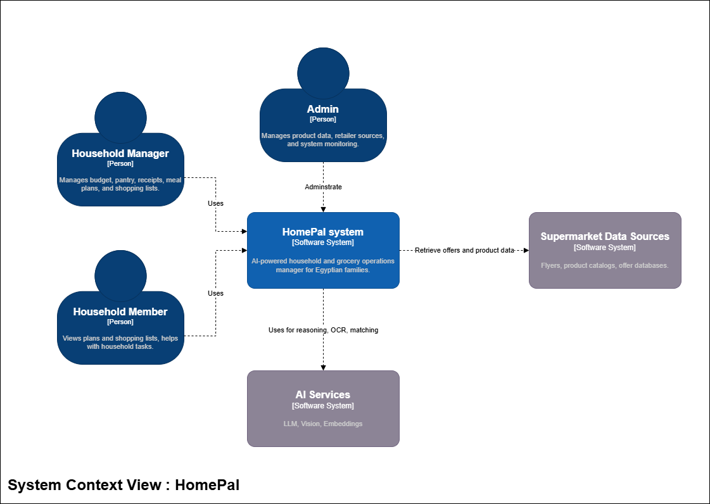
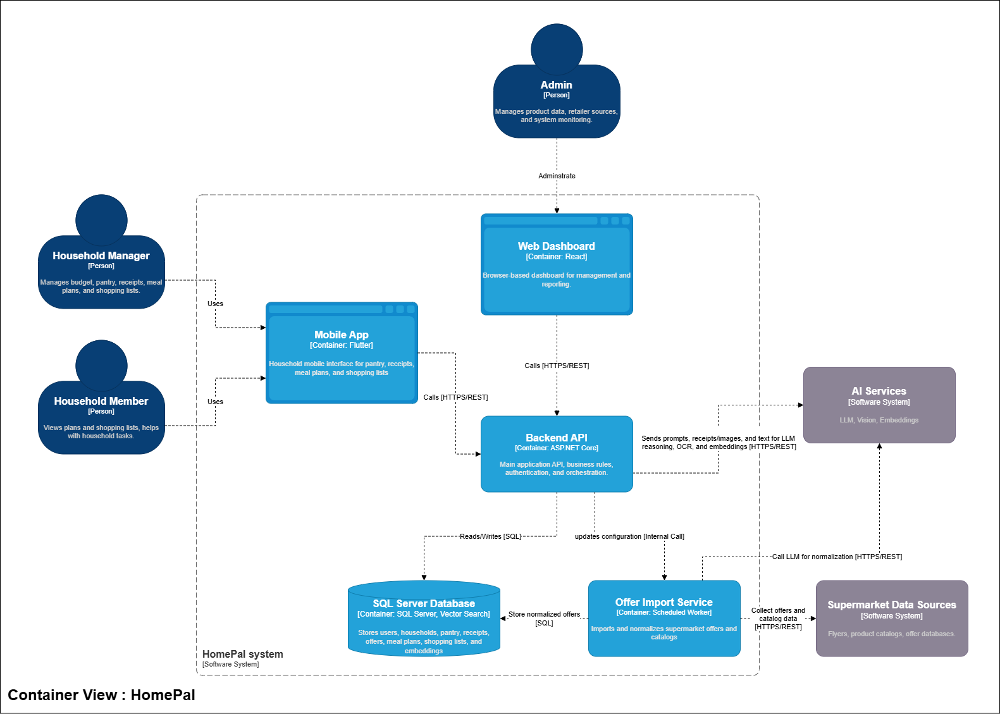
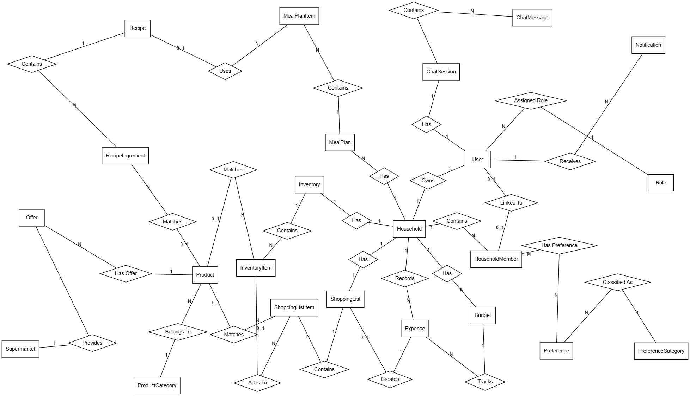
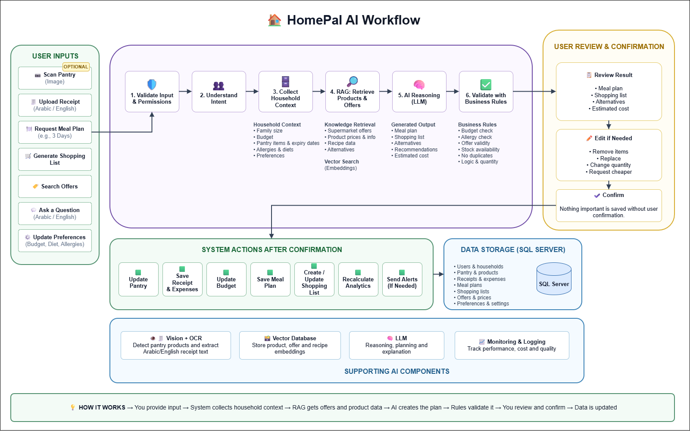

# HomePal — Project Design & Setup

## 1. Project Overview

**Project Name:** HomePal — Smart Household & Grocery Operations Manager

HomePal is an AI-powered household assistant that helps Egyptian families manage grocery budgets, track pantry inventory, process receipts, compare supermarket offers, generate affordable meal plans, and create optimized shopping lists.

### Primary Users

- **Household Manager:** Manages the budget, pantry, receipts, meal plans, and shopping lists.
- **Household Member:** Views plans and lists.
- **Administrator:** Manages retailer data sources, product data, preference catalogs, and system monitoring.

---

# 2. System Design

## 2.1 Architecture Diagram

### 2.1.1 System Context View



### 2.1.2 Container View



## 2.2 System Context Summary

### People

- **Household Manager:** Manages the budget, pantry, receipts, meal plans, shopping lists, and confirms AI suggestions.
- **Household Member:** Views plans and shopping lists.
- **Administrator:** Manages products, preference catalogs, retailer data sources, import failures, and system monitoring.

### External Systems

- **Supermarket Data Sources:** Product catalogs, weekly flyers, offer databases, and manually uploaded flyers.
- **AI Services:** LLM, vision, and embedding generation.
- **Email Service:** MailKit (SMTP / SendGrid) for email verification and password resets.
- **OAuth Providers:** Google Authentication for seamless sign-in.

## 2.3 Main Containers

### Mobile Application

- **Technology:** Flutter
- Supports pantry scanning, receipt uploads, meal plans, offers, and shopping lists.
- Communicates with the Backend API through HTTPS/REST using JSON.

### Web Dashboard

- **Technology:** React
- Supports household management, reports, offer comparison, and administration.
- Communicates with the Backend API through HTTPS/REST using JSON.

### Backend API

- **Technology:** ASP.NET Core (.NET 9)
- Structured using **Clean Architecture** principles (`Api`, `Application`, `Domain`, `Infrastructure`, `Persistence`, `Shared`).
- Handles authentication (JWT + Google OAuth), authorization (Role-based), request validation, and multi-lingual localization (`en-US`, `ar-EG`).
- Coordinates household setup, member management, invitation workflows, and preference assignment.
- Manages SQL Server data access via EF Core with migrations and Unit of Work / Repository patterns.

### Offer Import Service

- **Technology:** .NET Scheduled Worker
- Imports and normalizes supermarket products and offers.
- Uses approved automatic sources and manual flyer processing as a fallback.

### SQL Server Database

- **Technology:** SQL Server 2025 / Azure SQL
- Stores relational application data, Identity tokens, households, members, preferences, and vector embeddings.
- Supports semantic search, product matching, and offer retrieval.

---

# 3. Database Design

## 3.1 ERD Diagram



## 3.2 Implemented Entities vs Planned Entities

Below is the breakdown of database entities currently implemented in code versus planned for upcoming phases:

### Implemented Entities (Phase 1 — Core Identity, Household & Preferences)

| Entity | Main Attributes | Description / Implementation Notes |
|---|---|---|
| **ApplicationUser** | `Id, FirstName, LastName, Email, UserName, PhoneNumber, ProfilePictureUrl, IsProfileComplete, HouseholdId, CreatedAt` | Custom ASP.NET Core Identity user entity. |
| **RefreshToken** | `Id, UserId, Token, ExpiresAt, IsExpired, RevokedAt, IsActive` | Secure JWT refresh token tracking. |
| **Household** | `HouseholdId, Name, Country, City, CreatedAt` | Core household entity. |
| **HouseholdMember** | `HouseholdMemberId, HouseholdId, FullName, Relationship, Age, Gender, Notes, IsRegisteredUser, RegisteredUserId` | Unified member entity for registered & offline members. |
| **HouseholdInvitation** | `InvitationId, HouseholdId, InviterUserId, InviteeEmail, InviteeUserId, Token, Status, CreatedAt, RespondedAt` | Handles household invite workflow. Statuses: `Pending`, `Accepted`, `Rejected`, `Cancelled`, `Expired`. |
| **PreferenceCategory** | `PreferenceCategoryId, Name, Description, IsActive, CreatedAt` | System-wide preference categories with English/Arabic localization support. |
| **Preference** | `PreferenceId, PreferenceCategoryId, Name, NameArabic, Description, IsActive` | Dietary and household preferences with Arabic translation support. |
| **MemberPreference** | `HouseholdMemberId, PreferenceId, CreatedAt` | Junction entity storing dietary & personal preferences assigned to members. |

### Planned Entities (Phase 2 & 3 — Inventory, Marketplace, Meals & Finance)

- **Inventory:** `InventoryId, Name, Description, LowStockThreshold, LastScannedAt`
- **InventoryItem:** `InventoryItemId, RawName, Quantity, Unit, ExpiryDate, StorageLocation, EstimatedPrice, Source, MatchStatus`
- **Product:** `ProductId, Name, Brand, Barcode, Size, Unit`
- **ProductCategory:** `ProductCategoryId, Name, Description`
- **Supermarket:** `SupermarketId, Name, Country, City`
- **Offer:** `OfferId, OriginalPrice, CurrentPrice, Discount, StartDate, EndDate, IsActive`
- **ShoppingList:** `ShoppingListId, Status, EstimatedTotal, ActualTotal, ConfirmedAt, CompletedAt`
- **ShoppingListItem:** `ShoppingListItemId, RawName, Quantity, Unit, EstimatedPrice, ActualPrice, Priority, IsPurchased`
- **Recipe:** `RecipeId, Name, Description, Instructions, PreparationTime, CookingTime, Servings, EstimatedCost, Category`
- **RecipeIngredient:** `RecipeIngredientId, IngredientName, Quantity, Unit, IsOptional`
- **MealPlan:** `MealPlanId, StartDate, NumberOfDays, EstimatedCost, MaximumBudget, Status`
- **MealPlanItem:** `MealPlanItemId, MealName, DayNumber, MealType, Servings, EstimatedCost, IsConfirmed`
- **Budget:** `BudgetId, Month, Year, LimitAmount, WarningPercentage`
- **Expense:** `ExpenseId, Category, Amount, Description, ExpenseDate, Source`
- **Notification:** `NotificationId, Type, Title, Message, IsRead, CreatedAt`
- **ChatSession:** `ChatSessionId, Title, CreatedAt, UpdatedAt`
- **ChatMessage:** `ChatMessageId, SenderType, MessageText, CreatedAt`

---

# 4. API Design

## 4.1 API Conventions

- Base URL: `/api`
- Format: Standard JSON wrapping via `ApiResponse<T>` payload
- Authentication: JWT Bearer Token & Google OAuth ID Token
- Localization: Header `Accept-Language: en-US` or `ar-EG`
- Documentation: Swagger / OpenAPI specification
- Dates: ISO 8601 UTC
- Currency: Egyptian Pound (EGP)

### Standard Success Response

```json
{
  "success": true,
  "status": "Success",
  "message": "Operation completed successfully.",
  "data": { ... },
  "errors": null
}
```

### Standard Error Response

```json
{
  "success": false,
  "status": "ValidationError",
  "message": "One or more validation errors occurred.",
  "data": null,
  "errors": [
    {
      "field": "Email",
      "message": "Email address is required."
    }
  ]
}
```

---

## 4.2 API Endpoints Summary

Below is the full breakdown of implemented API endpoints versus planned endpoints.

### 4.2.1 Authentication & User Profile (`/api/auth`) — ✅ Implemented

| Method | Endpoint | Description | Auth Required |
|---|---|---|---|
| `POST` | `/api/auth/register` | Register a new user (Default role: Household Manager). | No |
| `POST` | `/api/auth/login` | Authenticate user via Email or Username + Password. | No |
| `POST` | `/api/auth/google` | Authenticate or register using Google OAuth ID Token. | No |
| `POST` | `/api/auth/refresh` | Refresh access token using active Refresh Token. | No |
| `POST` | `/api/auth/logout` | Revoke refresh token and logout user session. | Yes |
| `POST` | `/api/auth/forgot-password` | Send password-reset link to user's email. | No |
| `POST` | `/api/auth/reset-password` | Reset user password using email verification token. | No |
| `POST` | `/api/auth/change-password` | Change password for logged-in user. | Yes |
| `POST` | `/api/auth/confirm-email` | Confirm user email address with verification token. | No |
| `POST` | `/api/auth/resend-confirmation` | Resend email confirmation link. | No |
| `GET` | `/api/auth/me` | Get logged-in user profile & household status. | Yes |
| `PUT` | `/api/auth/profile` | Update profile information for logged-in user. | Yes |
| `POST` / `PUT` | `/api/auth/profile/image` | Upload or update user profile picture (`multipart/form-data`). | Yes |
| `DELETE` | `/api/auth/profile/image` | Delete user profile picture. | Yes |

---

### 4.2.2 Household Management (`/api/households`) — ✅ Implemented

| Method | Endpoint | Description | Roles Allowed |
|---|---|---|---|
| `POST` | `/api/households` | Create a new household (Creator becomes Household Manager). | Authenticated User |
| `GET` | `/api/households/my-household` | Get details of current user's active household. | Manager, Member, Admin |
| `PUT` | `/api/households` | Update household info (Name, Country, City). | Manager, Admin |
| `DELETE` | `/api/households` | Delete household and disband all members. | Manager, Admin |

---

### 4.2.3 Household Members (`/api/households/members`) — ✅ Implemented

| Method | Endpoint | Description | Roles Allowed |
|---|---|---|---|
| `GET` | `/api/households/members` | Get all members of the user's household. | Manager, Member, Admin |
| `GET` | `/api/households/members/{memberId}` | Get single member details by member ID. | Manager, Member, Admin |
| `POST` | `/api/households/members/offline` | Add an offline (non-registered) family member (children, elders, etc.). | Manager, Admin |
| `PUT` | `/api/households/members/{memberId}` | Update household member details. | Manager, Admin |
| `DELETE` | `/api/households/members/{memberId}` | Remove member from household or leave household. | Manager, Member, Admin |

---

### 4.2.4 Household Invitations (`/api/households/invitations`) — ✅ Implemented

| Method | Endpoint | Description | Roles Allowed |
|---|---|---|---|
| `POST` | `/api/households/invitations` | Send household invitation by Email or Username. | Manager, Admin |
| `GET` | `/api/households/invitations/my-invitations` | Get pending invitations received by the current user. | Authenticated User |
| `GET` | `/api/households/invitations` | Get sent invitations for the current household. | Manager, Admin |
| `POST` | `/api/households/invitations/{id}/cancel` | Cancel a sent pending invitation. | Manager, Admin |
| `POST` | `/api/households/invitations/{id}/accept` | Accept an invitation and join the household. | Authenticated User |
| `POST` | `/api/households/invitations/{id}/decline` | Decline a received invitation. | Authenticated User |

---

### 4.2.5 Preference Categories (`/api/preferences/categories`) — ✅ Implemented

| Method | Endpoint | Description | Roles Allowed |
|---|---|---|---|
| `GET` | `/api/preferences/categories` | Get all preference categories. | Manager, Member, Admin |
| `GET` | `/api/preferences/categories/search` | Search preference categories by query term. | Manager, Member, Admin |
| `GET` | `/api/preferences/categories/{categoryId}` | Get single category by ID. | Manager, Member, Admin |
| `POST` | `/api/preferences/categories` | Create a new preference category. | Admin |
| `PUT` | `/api/preferences/categories/{categoryId}` | Update a preference category. | Admin |
| `DELETE` | `/api/preferences/categories/{categoryId}` | Delete a preference category. | Admin |

---

### 4.2.6 System Preferences (`/api/preferences`) — ✅ Implemented

| Method | Endpoint | Description | Roles Allowed |
|---|---|---|---|
| `GET` | `/api/preferences` | Get all available preferences (optional filter by `categoryId`). | Manager, Member, Admin |
| `GET` | `/api/preferences/search` | Search preferences by query string and category. | Manager, Member, Admin |
| `GET` | `/api/preferences/{preferenceId}` | Get single preference by ID. | Manager, Member, Admin |
| `POST` | `/api/preferences` | Add a new system preference. | Admin |
| `PUT` | `/api/preferences/{preferenceId}` | Update an existing preference. | Admin |
| `DELETE` | `/api/preferences/{preferenceId}` | Delete a system preference. | Admin |

---

### 4.2.7 Household Member Preferences (`/api/households/members/{memberId}/preferences`) — ✅ Implemented

| Method | Endpoint | Description | Roles Allowed |
|---|---|---|---|
| `GET` | `/api/households/members/{memberId}/preferences` | Get preferences assigned to a specific household member. | Manager, Member, Admin |
| `PUT` | `/api/households/members/{memberId}/preferences` | Assign / replace dietary & health preferences for a member. | Manager, Member, Admin |
| `DELETE` | `/api/households/members/{memberId}/preferences/{preferenceId}` | Remove a preference from a member. | Manager, Member, Admin |

---

### 4.2.8 Planned Endpoints (Upcoming Modules)

- **Products, Supermarkets & Offers:** `/api/catalog/*` (Categories, Products, Supermarkets, Active Offers, Vector Search).
- **Inventory & Pantry Scanning:** `/api/inventory/*` (Items CRUD, Pantry Image Scan, Multi-item Confirm).
- **Shopping List:** `/api/shopping-list/*` (Items CRUD, List Confirm, List Complete, Auto-Inventory Sync).
- **Recipes & Meal Plans:** `/api/recipes/*` & `/api/meal-plans/*` (AI-assisted Plan Generation, Confirm Meal, Add Missing Ingredients to Shopping List).
- **Finance & Budgets:** `/api/finance/*` (Monthly Budgets, Expenses CRUD, Spending Summary Reports).
- **Notifications:** `/api/notifications/*` (List, Unread count, Mark as read).
- **AI Chatbot Assistant:** `/api/chat/*` (Session info, Send Message, Clear Chat History).

---

# 5. AI Design

## 5.1 Large Language Model

**Selected approach:** Gemini Flash multimodal model.

Responsibilities:

- Understand Arabic and English requests.
- Generate budget-aware meal plans.
- Suggest cheaper alternatives.
- Explain recommendations.
- Normalize OCR output when needed.
- Replan when constraints change.

## 5.2 Agent Framework

**Selected tools:** LangFlow with Langfuse observability.

The agent will:

- Understand the requested operation.
- Retrieve household context.
- Retrieve offers and product information.
- Call OCR, vision, embeddings, and LLM services.
- Validate output against business rules.
- Replan invalid recommendations.
- Request user confirmation before critical changes.

## 5.3 Vector Database

**Selected technology:** SQL Server Vector Search.

Embeddings will be stored for:

- Products.
- Supermarket offers.
- Recipes and ingredients.
- Flyer-extracted product records.

Main uses:

- Product matching.
- Offer retrieval.
- Similar-product discovery.
- Cheaper alternative retrieval.

## 5.4 Embedding Model

Use a multilingual embedding model supporting Arabic and English.

The exact model will be selected during implementation based on:

- Arabic accuracy.
- Cost.
- Latency.
- Provider availability.

## 5.5 AI Workflow



## 5.6 AI Safety and Reliability

- AI output is treated as a suggestion until confirmed.
- Pantry and receipt updates require user confirmation.
- Budget calculations are performed by backend code.
- Offer dates are validated before recommendation.
- Receipt images are deleted after extraction unless retention is requested.

---

# 6. Project Setup & Architecture

## 6.1 Repository Structure

The backend application is structured as a Clean Architecture solution under `.NET 9`:

- `HomePal.Api` — REST API controllers, OpenAPI setup, Middleware, and Request Localization.
- `HomePal.Application` — Business logic, Feature services, DTOs, Service Interfaces, and Mappers.
- `HomePal.Domain` — Domain Entities (`ApplicationUser`, `Household`, `HouseholdMember`, `HouseholdInvitation`, `PreferenceCategory`, `Preference`, `MemberPreference`, `RefreshToken`), Enums, and Constants.
- `HomePal.Infrastructure` — External services integration: JWT Provider, Google OAuth validator, MailKit Email Sender, and Local/Cloud File Storage.
- `HomePal.Persistence` — EF Core DB Context (`ApplicationDbContext`), Migrations, Entity Configurations, Seeding (`AdminSeeder`, `RoleSeeder`), and Unit of Work / Repository patterns.
- `HomePal.Shared` — Universal `ApiResponse<T>`, `Result` wrapper pattern, Errors, and Pagination contracts.

## 6.2 Git Workflow

### Branches

- `main`: Stable and releasable code.
- `develop`: Integration branch.
- `feature/<feature-name>`
- `fix/<issue-name>`
- `docs/<document-name>`
- `chore/<task-name>`

### Pull Request Rules

- No direct pushes to `main`.
- Each feature uses a separate branch.
- Pull requests target `develop`.
- At least one reviewer is required.
- Tests must pass before merge.

## 6.3 Commit Convention

```text
feat: add member preferences endpoints
fix: correct invitation expiration logic
docs: update API documentation
test: add auth service unit tests
refactor: simplify household invitation service
chore: update EF Core migrations
```

---

# 7. Initial Product Backlog & Implementation Status

## 7.1 Priority Levels

- **P0:** Must have
- **P1:** Important
- **P2:** Nice to have

## 7.2 User Stories & Current Status

| ID | User Story | Tasks | Priority | Status |
| --- | --- | --- | --- | --- |
| US-01 | As a user, I want to register, log in, recover my password, manage my profile, and use Google Sign-In. | Backend: Auth & Profile APIs (Register, Login, Google OAuth, Refresh, Password Reset, Email Confirmation, Profile Image). Mobile: auth and profile screens. Web dashboard: admin login only. | P0 | **Completed** |
| US-02 | As a user, I want to create and manage my household. | Backend: household CRUD endpoints & Service logic. Mobile: household setup and settings. System: automatic household binding. | P0 | **Completed** |
| US-03 | As a user, I want to add, edit, and remove household members (including offline family members). | Backend: member CRUD, offline member support, and authorization checks. Mobile: member-management screens. | P0 | **Completed** |
| US-04 | As a user, I want to invite a registered user to my household. | Backend: send, accept, decline, cancel, and list invitations. Mobile: invitation flow. Web dashboard: invitation monitoring. | P1 | **Completed** |
| US-05 | As a user, I want to manage household and member preferences. | Backend: preference categories CRUD & search, preferences CRUD & search, member preferences set & delete APIs with English/Arabic support. Mobile: preference selection. Web: catalog management. AI: preference constraints. | P0 | **Completed** |
| US-06 | As a user, I want to view and manually manage my inventory. | Backend: inventory item CRUD. Mobile: inventory list, add, edit, and delete. AI: optional product matching. | P0 | Pending |
| US-07 | As a user, I want to scan a receipt and confirm the extracted data. | Backend: scan and confirmation APIs, inventory and expense update. Mobile: camera, review, correction, and confirmation. AI: OCR, item extraction, prices, totals, and matching. Web dashboard: scan monitoring. | P0 | Pending |
| US-08 | As a user, I want to scan my pantry and confirm detected items. | Backend: pantry scan and confirmation APIs. Mobile: camera and review flow. AI: item detection, quantity estimation, and product matching. Web dashboard: failed-scan monitoring. | P0 | Pending |
| US-09 | As a user, I want to browse and search products and offers. | Backend: search, filters, pagination, and product details. Mobile: catalogue and offer screens. Web dashboard: product and offer management. | P0 | Pending |
| US-10 | As a user, I want personalized product and offer recommendations. | Backend: recommendation endpoints. Mobile: recommendation sections. AI: ranking using preferences, budget, inventory, and shopping list. Web dashboard: recommendation analytics. | P1 | Pending |
| US-11 | As a user, I want to manage the shared shopping list. | Backend: retrieve, add, edit, remove, and clear items. Mobile: shopping-list screen. AI: suggest low-stock and missing items. | P0 | Pending |
| US-12 | As a user, I want to confirm and complete my shopping list. | Backend: calculate totals, confirm, complete, and apply related inventory or expense changes. Mobile: confirmation and completion flow. AI: suggest cheaper products and offers. | P0 | Pending |
| US-13 | As a user, I want to browse recipes and view their details. | Backend: recipe listing, details, search, and filters. Mobile: recipe screens. Web dashboard: recipe management. AI: optional semantic search and tagging. | P0 | Pending |
| US-14 | As a user, I want HomePal to generate a meal plan using my inventory, preferences, and budget. | Backend: generation, saving, editing, and confirmation. Mobile: generation and review screens. AI: generate constrained meal plans. Web dashboard: meal-generation analytics. | P0 | Pending |
| US-15 | As a user, I want missing meal-plan ingredients added to my shopping list. | Backend: compare ingredients with inventory and update the list. Mobile: review missing items. AI: ingredient matching and quantity calculation. | P0 | Pending |
| US-16 | As a user, I want to set and track my budget and expenses. | Backend: current budget, history, and expense CRUD. Mobile: budget and expense screens. Web dashboard: aggregated spending analytics. AI: optional spending insights. | P0 | Pending |
| US-17 | As a user, I want reports about spending, inventory, waste, and savings. | Backend: report aggregation and generation. Mobile: simple report summaries. Web dashboard: detailed reports, charts, filters, and exports. AI: generate report insights. | P1 | Pending |
| US-18 | As a user, I want to ask the HomePal assistant questions using my household data. | Backend: chat APIs and tool integration. Mobile: chat interface. AI: access inventory, budget, products, offers, recipes, and shopping list. Web dashboard: AI usage and latency monitoring. | P0 | Pending |
| US-19 | As a user, I want to view and clear my private chat history. | Backend: retrieve and delete messages from the user’s chat session. Mobile: history and clear actions. AI: conversation context handling. | P0 | Pending |
| US-20 | As a user, I want notifications for invitations, budget limits, expiry dates, and low stock. | Backend: notification rules and APIs. Mobile: notification center and push handling. Web dashboard: delivery and failure monitoring. | P1 | Pending |
| US-21 | As an admin, I want to manage collected products and offers. | Backend: collection jobs, validation, retry, and publishing. Web dashboard: sources, jobs, products, errors, and approvals. AI: extraction, cleaning, categorization, and duplicate matching. | P1 | Pending |
| US-22 | As an admin, I want to monitor the system. | Backend: health checks, logs, metrics, and audit data. Web dashboard: users, households, scans, AI usage, errors, and system health. | P1 | Pending |
| US-23 | As a user or admin, I want to export reports. | Backend: PDF or file generation. Mobile: download or share. Web dashboard: detailed report export. | P2 | Pending |

---

# 8. Summary of Progress & Completed Features

As of the current development phase, the backend foundational layer and core domain management modules have been fully implemented and verified:

1. **Authentication & Identity System:**
   - User registration and login using JWT Access & Refresh Tokens.
   - Google OAuth ID Token authentication integration.
   - Profile management including full name, phone, completion status, and profile picture upload/deletion.
   - Account security: Password reset flow, Change password, Email confirmation via MailKit.

2. **Household & Member Management:**
   - Household creation (assigning creator as `HouseholdManager`), update, retrieval, and deletion.
   - Addition and management of offline/non-registered family members (e.g., kids, elderly members).
   - Household invitation workflow: Sending invites by email/username, viewing pending invites, accepting, declining, and cancelling invitations.

3. **Preference & Category Catalog:**
   - System-wide preference categories with search & CRUD (Admin restricted for mutations).
   - Preference item management with Arabic translation support (`NameArabic`).
   - Assigning, updating, and removing personal/dietary preferences for specific household members.

4. **Architecture & Technical Infrastructure:**
   - ASP.NET Core Clean Architecture layers (`Api`, `Application`, `Domain`, `Infrastructure`, `Persistence`, `Shared`).
   - Generic Repository & Unit of Work pattern implementation.
   - Global Request Localization supporting `en-US` and `ar-EG` cultures with localized error messages.
   - Universal API response structure (`ApiResponse<T>`) and exception handling.
   - EF Core migrations tracking schema evolution.
